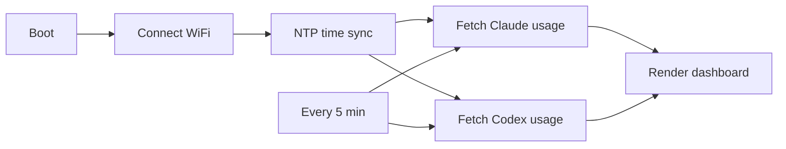

# UsageMonitor

> A standalone e-paper desk display for your Claude Code and Codex usage quotas. The device connects to WiFi and talks directly to the provider APIs — no companion app, no PC left running.

English · [简体中文](README.zh-CN.md)

## What It Shows

A two-column dashboard (Codex on the left, Claude on the right). For each provider:

- **Session (5h)** — the rolling 5-hour window: big remaining %, a used-% bar, and a reset countdown. This is the largest element.
- **Weekly (7d)** — the 7-day window, same layout, secondary emphasis.
- **Claude only**: Sonnet and Opus 7-day usage rows.
- **Codex only**: credits balance.
- **Plan** (Plus / Pro / Free) and, for Claude, extra-usage spend.

A footer shows when the data was last updated. If a fetch is stale or a sign-in expired, the affected column says so.

### What it does NOT show, and why

The device reads usage **directly from the provider cloud APIs**, which expose rate-limit windows, credits, and plan — but not per-token counts, per-model token totals, request/conversation counts, or a calendar-day total. Those numbers only exist in the local CLI logs on your computer and would require a companion service. This project is intentionally self-contained, so it shows what the device can fetch on its own.

## How It Works



The device holds OAuth tokens, calls each provider's usage endpoint over HTTPS, refreshes its own bearer tokens when they expire, and persists rotated tokens to NVS. On a fetch failure it keeps showing the last good snapshot, marked stale.

| Module | Responsibility |
| --- | --- |
| `src/main.cpp` | Entry point and top-level config |
| `UsageApp.*` | Orchestration: boot, WiFi, NTP, poll loop, persistence |
| `HttpClient.*` | HTTPS transport (response headers, Retry-After) |
| `OAuthClient.*` | Authed request with refresh-then-retry |
| `TokenStore.*` | NVS persistence of rotated tokens |
| `ClaudeUsageClient.*` / `CodexUsageClient.*` | Per-provider adapters |
| `UsageUI.*` | E-paper drawing |
| `TextRenderer.*` | English bitmap font / Chinese OpenFontRender |
| `UiLang.h` | Fixed UI strings and language selection |
| `QuotaMath.h` / `TimeFormat.h` / `IsoTime.h` / `HeaderField.h` / `UsageSnapshot.h` | Pure logic (native-tested) |

## Supported Hardware

| Device | Screen | Layout |
| --- | --- | --- |
| reTerminal E1001 | 4-level gray | Compact two-column |
| reTerminal E1002 | 6-color | Compact two-column (red/yellow/green status) |
| reTerminal E1003 | 16-level gray | Full two-column dashboard |
| reTerminal E1003 Chinese | 16-level gray | Same, rendered with an embedded Chinese font |

## Quick Start

### 1. Install PlatformIO

Install [PlatformIO](https://platformio.org/) through VS Code or the command line.

### 2. Provide your tokens

Log in on your computer with the official CLIs first, so the credential files exist:

- Claude: `claude login` → writes `~/.claude/.credentials.json`
- Codex: `codex login` → writes `~/.codex/auth.json`

Then copy the secrets template and fill it in:

```sh
cp include/secrets.example.h src/secrets.h
```

A helper can print the exact `#define` lines from your local credential files:

```sh
python3 scripts/provision.py
```

Paste its output (and your WiFi credentials) into `src/secrets.h`. `src/secrets.h` is git-ignored — never commit real tokens.

> The device cannot complete a browser OAuth flow. It refreshes tokens on its own as long as the refresh token is valid; if a refresh token is revoked (you log out, change your password, or the provider clears the session), the screen tells you to re-login on your computer and re-flash.

### 3. Build and upload

```sh
# reTerminal E1001 / E1002 / E1003 (English)
pio run -e reterminal_e1001 --target upload
pio run -e reterminal_e1002 --target upload
pio run -e reterminal_e1003 --target upload

# reTerminal E1003 with Codex on the left and Zai/Zhipu on the right
pio run -e reterminal_e1003_codex_zai --target upload

# reTerminal E1003 (Simplified Chinese)
pio run -e reterminal_e1003_zh --target upload
```

The Chinese font is embedded into the firmware at build time, so a single `upload` is all that is needed. Monitor serial output:

```sh
pio device monitor
```

## Development

Run the native unit tests (pure logic — quota math, countdown formatting, UTC/ISO8601 parsing, token expiry, header/body selection):

```sh
pio test -e native
```

## Security Notes

- Keep real WiFi passwords and OAuth tokens only in `src/secrets.h`.
- The HTTPS calls use simplified certificate handling (`setInsecure()`) for developer convenience. Production firmware should pin a CA certificate for `api.anthropic.com`, `platform.claude.com`, `chatgpt.com`, and `auth.openai.com`.
- The usage endpoints are not official public APIs; they are derived from the CLIs and may change when the CLIs update. The firmware degrades to the last good snapshot when a call fails.
