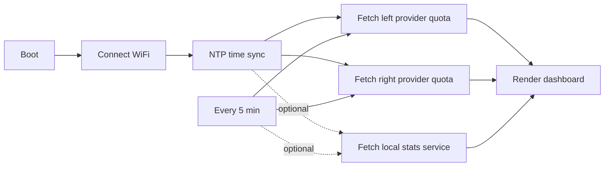

# UsageMonitor


> A desk e-paper dashboard that keeps AI coding assistant quotas visible all day, without opening another browser tab.

English · [简体中文](README.zh-CN.md)


UsageMonitor turns a Seeed reTerminal E-series e-paper device into a compact quota cockpit for AI coding tools. It can show two providers side by side, refresh OAuth tokens, keep the last good snapshot when a request fails, and optionally merge local CLI-log statistics from your computer.

> The hero and concept images are AI-generated for presentation. The Feature Tour section uses a real device photo.

## Acknowledgements

Special thanks to [ClaudeBar](https://github.com/tddworks/ClaudeBar). Most of the provider usage API discovery and adapter design in this project was heavily informed by ClaudeBar. UsageMonitor is an independent e-paper and PlatformIO implementation, but the API exploration work in ClaudeBar was an important reference.

## Why Star This

- **Always-on quota awareness** - keep rolling 5-hour and 7-day limits visible on a low-power desk display.
- **Two providers at once** - compare left and right providers on one screen instead of checking multiple tools.
- **Cloud quota plus local stats** - show provider quota data, then optionally add today tokens, sessions, latest activity, and model breakdowns from local CLI logs.
- **Real embedded firmware** - PlatformIO, ESP32-S3, HTTPS fetches, OAuth refresh, NVS token persistence, and native unit tests.
- **Made for reTerminal E-series** - ready environments for E1001, E1002, E1003, and a Simplified Chinese E1003 build.
- **Hackable provider adapters** - provider logic is split into focused clients, so you can add or swap data sources without rewriting the UI.

## Feature Tour


This is a real reTerminal E1003 photo with the Codex + Zai dashboard running on the device.

| Feature | What you get |
| --- | --- |
| **Session window** | A large rolling 5-hour quota panel with remaining percentage, used bar, and reset countdown. |
| **Weekly window** | A secondary 7-day quota panel for longer-term usage planning. |
| **Quota details** | Compact rows for used percentage, remaining percentage, reset time, and provider-specific fields. |
| **Provider extras** | Balance, plan, extra spend, model quota, or other rows when the provider returns real data. |
| **Stale fallback** | If a request fails, the screen keeps the last good snapshot and marks the affected column as stale. |
| **Bilingual UI** | English by default, with a Simplified Chinese E1003 build that embeds the font at firmware build time. |

## What It Connects


The firmware can talk directly to provider usage endpoints over HTTPS. The optional local stats service runs on your computer, reads local CLI logs, and exposes one unified JSON endpoint for the device.

Supported provider adapters in this project:

| Provider | Cloud quota firmware | Optional local stats |
| --- | --- | --- |
| Claude | Yes | Yes |
| Codex | Yes | Yes |
| Copilot | Yes | Yes |
| MiniMax | Yes | Yes |
| Kimi | Yes | Yes |
| Zai / Zhipu | Yes | Yes |

The local stats service never invents data. If a provider has no readable local log source, it returns `available=false`, and the firmware falls back to the cloud quota layout.

## Hardware Targets


| Device | Screen | Layout |
| --- | --- | --- |
| reTerminal E1001 | 4-level gray | Compact two-column |
| reTerminal E1002 | 6-color | Compact two-column with color status cues |
| reTerminal E1003 | 16-level gray | Full two-column dashboard |
| reTerminal E1003 Chinese | 16-level gray | Full dashboard rendered with an embedded Chinese font |

## Quick Start

### 1. Install PlatformIO

Install [PlatformIO](https://platformio.org/) through VS Code or the command line.

### 2. Provide your tokens

Log in on your computer with the official CLIs first, so the credential files exist:

- Claude: `claude login` writes `~/.claude/.credentials.json`
- Codex: `codex login` writes `~/.codex/auth.json`

Then copy the secrets template and fill it in:

```sh
cp include/secrets.example.h src/secrets.h
```

A helper can print the exact `#define` lines from your local credential files:

```sh
python3 scripts/provision.py
```

Paste its output and your WiFi credentials into `src/secrets.h`. This file is git-ignored, so real tokens stay out of the repository.

> The device cannot complete a browser OAuth flow. It refreshes tokens on its own as long as the refresh token is valid. If a refresh token is revoked, log in again on your computer and re-flash the firmware.

### 3. Build and upload

```sh
# reTerminal E1001 / E1002 / E1003, English
pio run -e reterminal_e1001 --target upload
pio run -e reterminal_e1002 --target upload
pio run -e reterminal_e1003 --target upload

# reTerminal E1003, Codex on the left and Zai/Zhipu on the right
pio run -e reterminal_e1003_codex_zai --target upload

# Same display pair, with optional computer-side local stats enabled
pio run -e reterminal_e1003_codex_zai_local --target upload

# reTerminal E1003, Simplified Chinese
pio run -e reterminal_e1003_zh --target upload
```

The Chinese font is embedded into the firmware at build time, so a single `upload` is enough. Monitor serial output with:

```sh
pio device monitor
```

## Optional Local Stats Service


Start the service on the computer that stores your CLI logs:

```sh
python3 local_stats_service/server.py --host 0.0.0.0 --port 8787
```

Find that computer's LAN IP address. On macOS WiFi, start with:

```sh
ipconfig getifaddr en0
```

If that prints nothing, try:

```sh
ipconfig getifaddr en1
```

Use a LAN address such as `192.168.x.x` or `10.x.x.x`. Do not use `127.0.0.1`, because that means "this same computer", and the e-paper device cannot reach it.

Set `UM_LOCAL_STATS_URL` in `src/secrets.h`:

```cpp
#define UM_LOCAL_STATS_URL "http://10.10.50.65:8787"
```

Then build an environment that defines `UM_ENABLE_LOCAL_STATS`:

```sh
pio run -e reterminal_e1003_codex_zai_local --target upload
```

By default the service scans known CLI directories such as `~/.claude/projects` and `~/.codex`. You can override any provider log root with environment variables like `UM_LOCAL_CLAUDE_LOG_DIR` or `UM_LOCAL_CODEX_LOG_DIR`.

## How It Works



The device holds OAuth tokens, calls each provider's usage endpoint over HTTPS, refreshes its own bearer tokens when they expire, and persists rotated tokens to NVS. On a fetch failure it keeps showing the last good snapshot, marked stale.

| Module | Responsibility |
| --- | --- |
| `src/main.cpp` | Entry point and top-level config |
| `UsageApp.*` | Orchestration: boot, WiFi, NTP, poll loop, persistence |
| `HttpClient.*` | HTTPS transport, response headers, and Retry-After handling |
| `OAuthClient.*` | Authenticated request with refresh-then-retry |
| `TokenStore.*` | NVS persistence of rotated tokens |
| `*UsageClient.*` | Per-provider quota adapters |
| `LocalStatsClient.*` | Optional computer-side local stats fetcher |
| `UsageUI.*` | E-paper drawing |
| `TextRenderer.*` | English bitmap font and Chinese OpenFontRender path |
| `UiLang.h` | Fixed UI strings and language selection |
| `QuotaMath.h` / `TimeFormat.h` / `IsoTime.h` / `HeaderField.h` / `UsageSnapshot.h` | Pure logic covered by native tests |
| `local_stats_service/` | Optional Python service for local CLI-log stats |

## Development

Run the native unit tests:

```sh
pio test -e native
```

The native tests cover pure logic such as quota math, countdown formatting, UTC/ISO8601 parsing, token expiry, and header/body field selection.

## Security Notes

- Keep real WiFi passwords and OAuth tokens only in `src/secrets.h`.
- The local stats service listens on your LAN when started with `--host 0.0.0.0`; run it only on a trusted network.
- The HTTPS calls use simplified certificate handling with `setInsecure()` for developer convenience. Production firmware should pin CA certificates for the provider hosts.
- The usage endpoints are not official public APIs. They are derived from the CLIs and may change when the CLIs update. The firmware degrades to the last good snapshot when a call fails.
