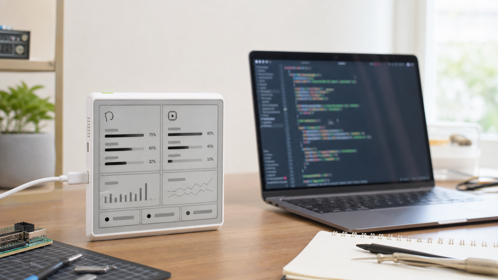
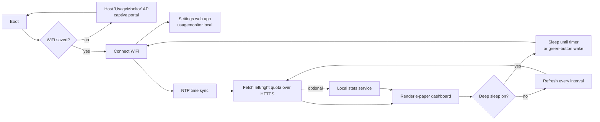

# UsageMonitor


> A desk e-paper dashboard that keeps your AI coding-assistant quotas visible all
> day — now configured entirely over WiFi and a built-in web app, with **no
> `secrets.h`, no per-provider rebuilds, and no reflash to change anything**.

English · [简体中文](README.zh-CN.md) *(upstream doc, predates the changes below)*



UsageMonitor turns a Seeed reTerminal E1001 e-paper device into a compact quota
cockpit for AI coding tools. It shows two providers side by side, refreshes OAuth
tokens on its own, keeps the last good snapshot when a request fails, sleeps
between fetches to run for days on battery, and is set up start-to-finish from
your phone or laptop.

> This is an **enhanced fork** of
> [`limengdu/ePaper_vibe_coding_ai_usage_track`](https://github.com/limengdu/ePaper_vibe_coding_ai_usage_track).
> The original required editing `secrets.h` and reflashing to set WiFi, pick
> providers, or change tokens. See **[What's different](#whats-different-from-the-original)**.

## What's different from the original

The upstream app chose its providers **at compile time** (macros, one build per
combination) and baked WiFi + tokens into `src/secrets.h` with a `provision.py`
helper. **Changing anything meant editing a file and reflashing.** This fork
replaces that with on-device configuration and adds power management, a new
provider, and a full typography overhaul.

### 1. Zero-reflash setup & onboarding *(headline change)*
- **WiFi captive-portal AP.** On first boot (or whenever no network is saved) the
  device hosts a **`UsageMonitor`** WiFi access point. Join it from a phone, pick
  your SSID, type the password — no WiFi credentials in the firmware.
- **Self-hosted config web app** at **`http://usagemonitor.local`** (mDNS) or the
  device IP — a single-page app with **Credentials / Display / System / Status**
  tabs.
- **Runtime provider selection.** Choose the left/right provider from a dropdown.
  All providers are compiled into one firmware (no more per-combo build envs).
- **Credentials in the web UI, stored in NVS** — not `secrets.h`. Tokens are
  **tested on save** (pass/fail), credential boxes are **color-coded** by status,
  and each provider has a **Clear Token** button.

### 2. New 7th provider — Claude Platform
Admin-key usage/cost reporting with **per-model spend bars**, **30-day cost**,
**prepaid vs spend** modes, a "$ left to spend" headline, and token usage.

### 3. Power management *(entirely new)*
- **Deep sleep** between fetches with **green-button (GPIO3) wake**, a configurable
  refresh interval, screen preserved on wake (no full-screen flash), a green wake
  box, and a sleep-warning modal + countdown in the web UI.
- **Battery:** header icon, voltage (mV), configurable "full" mV, and a **runtime
  estimate (days remaining)** that works in both deep-sleep and always-awake modes.
  Charge vs discharge is detected from the **battery-voltage trend** (the E1001 has
  no charge/VBUS pin). While the live estimate calibrates, the device shows a
  **learned placeholder** (recorded per battery level, persisted in NVS) in
  *italics*.

### 4. Display & typography overhaul
- E1001 compact + large layouts; redesigned header (app-name pill, version, deep-
  sleep moon, **Last / Next fetch** line); window cards with a big used-% figure,
  remaining %, and a growing usage bar; **dark mode**.
- **OpenFontRender** TrueType rendering at any pixel size (replaced the fixed
  bitmap fonts); a **14-typeface runtime font picker**; a grayscale **smoothing**
  toggle; a **sharpness/contrast** slider; text weight; a **hard-black crisp**
  default; **Lexend** as the default face; a **Font-Testing playground**; and a
  simple/advanced settings split.

### 5. Reliability & ops
Per-provider **circuit breaker** with on-screen failure notices and clear failure
messages; boot-token resync; no-cache responses; sleep/web sync fixes; verbose API
logging with a **USB serial log mirror**.

### 6. Security
Closed a token leak via `GET`, capped the POST body, escaped status JSON (see
`SECURITY.md`), and added an optional **Secure Tokens** mode that hides saved
secrets and reveals only what you type in the current session.

### 7. Build & architecture
Flattened `src/` into the repo root; added `ConfigStore` (NVS), `SettingsServer`
(web app), a `UsageClientBase` provider interface, and `battery_tracker`. Builds
with **arduino-cli** as a single sketch targeting the E1001.

## Feature highlights

- **Always-on quota awareness** — rolling 5-hour and 7-day limits on a low-power
  desk display that sleeps between refreshes.
- **Two providers at once** — compare a left and right provider on one screen.
- **Configured from your phone** — WiFi AP onboarding + a web app; nothing baked
  into the firmware.
- **Seven provider adapters** — Claude OAuth, Codex, Copilot, MiniMax, Kimi, Zai,
  and Claude Platform.
- **Runs for days on battery** — deep sleep, button wake, and a self-learning
  runtime estimate.
- **Tunable rendering** — TrueType fonts, 14 typefaces, smoothing/sharpness, dark
  mode, and a font playground.

## Providers

| Provider | Cloud quota | Notes |
| --- | --- | --- |
| Claude (OAuth) | Yes | 5-hour + 7-day windows, model quotas |
| Codex | Yes | OAuth usage |
| Copilot | Yes | |
| MiniMax | Yes | region-selectable |
| Kimi | Yes | |
| Zai / Zhipu | Yes | endpoint-selectable |
| **Claude Platform** *(new)* | Yes | admin-key usage/cost, per-model bars, 30-day cost, prepaid/spend |

An optional computer-side **local stats service** can add today's tokens,
sessions, and model breakdowns from local CLI logs (see below).

## Hardware

| Device | Screen | Status in this fork |
| --- | --- | --- |
| **reTerminal E1001** | 4-level gray | **Primary / validated** — all features here are developed and tested on the E1001 |
| reTerminal E1002 / E1003 | 6-color / 16-level gray | Inherited from upstream; the new web-config / power / font work is not validated on these |
| reTerminal E1003 (Chinese) | 16-level gray | Inherited from upstream (embedded font, build-time) |

The E1001 is a XIAO-ESP32-S3 board, so the arduino-cli FQBN below is the
`XIAO_ESP32S3` target.

## Setup

No `secrets.h`, no `provision.py`, no per-provider build. Flash once, then
configure over WiFi.

### 1. Flash the firmware (once)

Install the **ESP32 Arduino core** and these libraries (the firmware vendors
`DragynESPAsyncWiFiManager` and `EspAppLog`/`AppLog` in-repo; the rest are
external):

- `Seeed_GFX` (e-paper driver)
- `OpenFontRender` (TrueType text)
- `ESPAsyncWebServer` + `AsyncTCP` (settings web app)
- `ArduinoJson`

Compile and upload with arduino-cli (point `--library` at wherever you keep the
custom libraries, and set your serial port):

```sh
arduino-cli compile --fqbn esp32:esp32:XIAO_ESP32S3:PSRAM=opi \
  --library /path/to/Seeed_GFX \
  --library /path/to/EspAppLog \
  --library /path/to/DragynESPAsyncWiFiManager \
  --library /path/to/OpenFontRender \
  .

arduino-cli upload -p COM12 --fqbn esp32:esp32:XIAO_ESP32S3:PSRAM=opi .
```

> Flashing requires the device to be **awake** (USB-CDC enumerated). If it's in
> deep sleep, press the green wake button first, or hold **BOOT** and tap
> **RESET** to enter download mode.

#### Or flash the prebuilt image (no build)

A full merged flash image is committed under
[`bin/`](bin/) — e.g. `bin/E1001-AIUsageMonitor.v.1.15.10.bin` (bootloader +
partitions + app). Write it to offset `0x0` with esptool:

```sh
esptool.py --chip esp32s3 -p COM12 write_flash 0x0 bin/E1001-AIUsageMonitor.v.1.15.10.bin
```

> ⚠️ The merged image flashes at **`0x0`** and **full-erases the chip, including
> NVS** — WiFi credentials, saved tokens, and all settings are wiped. Use it for a
> clean restore; you'll re-onboard over WiFi afterward. (An app-only image that
> flashes at `0x10000` and preserves NVS is produced by `build.ps1` but not
> shipped here.)

### 2. Join the device's WiFi AP

On first boot the screen shows **"Connect to 'UsageMonitor' AP"**. From a phone or
laptop, join the **`UsageMonitor`** WiFi network — a captive portal opens. Pick
your home WiFi and enter its password. The device saves it and reconnects on its
own from then on.

### 3. Configure in the web app

Open **`http://usagemonitor.local`** (or the device's IP, shown on screen and in
the serial log) and use the tabs:

- **Credentials** — paste each provider's tokens; they're **tested on save** and
  the box turns green (valid) or red (failed). **Clear Token** wipes one provider.
- **Display** — choose the **left** and **right** providers, dark mode, font,
  smoothing/sharpness.
- **System** — refresh interval, **Enable Deep Sleep**, **Secure Tokens**, and
  (advanced) battery "full" mV and the Font-Testing playground.
- **Status** — live IP, WiFi, battery (% / mV / runtime estimate), uptime, and the
  active providers.

That's it — change providers or credentials any time from this page; the device
never needs reflashing for configuration.

> **Deep-sleep note:** when Deep Sleep is enabled, the settings page is only
> reachable during the ~5-minute window after a power-on, reset, or button wake.

### Getting provider tokens

Logging in with the official CLIs creates the credential files you copy values
from:

- Claude: `claude login` → `~/.claude/.credentials.json`
- Codex: `codex login` → `~/.codex/auth.json`

Paste the access/refresh tokens into the **Credentials** tab. The device refreshes
OAuth bearer tokens itself and persists rotated tokens to NVS; it cannot complete a
browser OAuth flow. If a refresh token is revoked, log in again on your computer
and paste the new values — still no reflash.

## Optional local stats service

Add today's tokens, sessions, and model breakdowns from your computer's CLI logs.
Run the service on the machine that stores those logs:

```sh
python3 local_stats_service/server.py --host 0.0.0.0 --port 8787
```

Find that computer's LAN IP (e.g. macOS WiFi `ipconfig getifaddr en0`) — use a
`192.168.x.x` / `10.x.x.x` address, never `127.0.0.1`. Set the local-stats URL in
the web app, e.g. `http://10.10.50.65:8787`. The service never invents data: if a
provider has no readable local log, it returns `available=false` and the device
falls back to the cloud layout.

## How it works



The device holds OAuth tokens, calls each provider's usage endpoint over HTTPS,
refreshes bearer tokens when they expire, and persists rotated tokens to NVS. On a
fetch failure it keeps the last good snapshot, marked stale, and trips a
per-provider circuit breaker after repeated failures.

| Module | Responsibility |
| --- | --- |
| `*.ino` / `UsageApp.*` | Boot, WiFi/AP onboarding, NTP, fetch loop, deep sleep, persistence |
| `ConfigStore.*` | NVS settings + credentials, learned battery-estimate table |
| `SettingsServer.*` | Embedded web app (Credentials/Display/System/Status) + JSON APIs |
| `DragynESPAsyncWiFiManager.*` | WiFi captive-portal onboarding |
| `HttpClient.*` / `OAuthClient.*` / `TokenStore.*` | HTTPS, refresh-then-retry, NVS token rotation |
| `UsageClientBase.h` + `*UsageClient.*` | Per-provider quota adapters (incl. Claude Platform) |
| `battery_tracker.*` | Runtime estimate + mV-trend charge detection |
| `UsageUI.*` / `TextRenderer.*` | E-paper drawing + OpenFontRender / baked-font text |
| `LocalStatsClient.*` + `local_stats_service/` | Optional computer-side local stats |
| `QuotaMath.h` / `TimeFormat.h` / `IsoTime.h` / `UsageSnapshot.h` | Pure logic covered by native tests |

## Development

Pure logic (quota math, countdown formatting, UTC/ISO8601 parsing, token expiry,
field selection) is covered by native unit tests:

```sh
pio test -e native
```

## Security notes

- Credentials live in NVS, not in the repo. **Secure Tokens** mode hides saved
  secrets in the web UI and reveals only what you type in the session.
- The `UsageMonitor` onboarding AP is open while active; run setup on a trusted
  network and let the device reconnect to your WPA network afterward.
- HTTPS calls use `setInsecure()` for developer convenience; production firmware
  should pin CA certificates for the provider hosts.
- The usage endpoints are derived from the CLIs, not official public APIs, and may
  change; the firmware degrades to the last good snapshot when a call fails.

## Version history (this fork)

Condensed; see `git log` for detail.

- **v1.15.10** — header shows the current date after the version; e-paper
  flicker/bounce hardening: fixed-width Fetch clock + `$`/STALE slots so the
  header no longer re-centers each fetch, draw-fingerprint de-dup to drop
  redundant full refreshes, frozen platform bottom block + constant-height
  usage bar.
- **v1.15.x** — security/stability hardening: Mozilla TLS CA-bundle + CSRF/XSS
  guards, bearer-token rotation, 16 KB loop-task stack boot-loop fix, Claude
  token-expiry readout.
- **v1.14.x** — battery runtime estimate on battery in awake + deep sleep, mV-trend
  charge detection, learned italic placeholder estimates; header/card display
  tweaks.
- **v1.13.0** — hard-black crisp default, Lexend, Font-Testing playground,
  simple/advanced settings.
- **v1.9–v1.11** — OpenFontRender TrueType text, 14-font picker, grayscale
  smoothing + sharpness slider.
- **v1.7–v1.8** — battery runtime tracker, Claude Platform spend/prepaid mode,
  header redesign + web Status tab.
- **v1.5–v1.6** — reliable deep sleep + button wake, Last/Next fetch header,
  battery mV, sleep-warning modal.
- **v1.2–v1.4** — dark mode, per-provider circuit breaker + credential testing/status,
  Claude Platform admin-key usage/cost.
- **v1.1** — settings web app, runtime provider selection, NVS config, flattened
  source layout.

## Acknowledgements

Forked from [`limengdu/ePaper_vibe_coding_ai_usage_track`](https://github.com/limengdu/ePaper_vibe_coding_ai_usage_track).
Provider usage-API discovery and adapter design were heavily informed by
[ClaudeBar](https://github.com/tddworks/ClaudeBar); UsageMonitor is an independent
e-paper implementation, but that API-exploration work was an important reference.

### Libraries

- **WiFi onboarding** — `DragynESPAsyncWiFiManager` is a fork of the WiFiManager
  captive-portal lineage: **WiFiManager** by AlexT
  ([github.com/tzapu](https://github.com/tzapu)), ported to the async web server by
  alanswx ([ESPAsyncWiFiManager](https://github.com/alanswx/ESPAsyncWiFiManager)).
  MIT licensed.
- **TrueType text** — [OpenFontRender](https://github.com/takkaO/OpenFontRender) by
  takkaO.
- **Display driver** — `Seeed_GFX` (Seeed Studio).
- **Logging** — `EspAppLog` is the author's own library, extracted from the
  DragynWeather firmware (not a third-party dependency); `DragynESPAsyncWiFiManager`
  is likewise the author's WiFiManager derivative.
