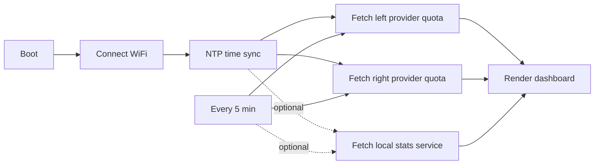

# UsageMonitor

> An e-paper desk display for AI coding assistant usage quotas. By default the device talks directly to provider APIs. An optional computer-side local stats service can add today-token and model-breakdown panels.

English · [简体中文](README.zh-CN.md)

## What It Shows

A dense two-column dashboard. The selected left and right providers are compile-time choices in `platformio.ini`; each column clearly labels its provider. For each provider:

- **Session (5h)** — the rolling 5-hour window: big remaining %, a used-% bar, and a reset countdown. This is the largest element.
- **Weekly (7d)** — the 7-day window, same layout, secondary emphasis.
- **Quota details** — a compact table with used %, remaining %, and reset time.
- **Provider-specific extras** — balance, plan, extra spend, or model quota rows when available.
- **Optional local usage** — today tokens, input/output/cache split, sessions, latest activity, and top models when the local stats service is enabled.

A footer shows when the data was last updated. If a fetch is stale or a sign-in expired, the affected column says so.

### Local stats mode

Without the local stats service, the device shows only cloud quota data. With the service enabled, the computer reads local CLI logs and exposes a unified `/v1/snapshot` JSON endpoint for all firmware-supported providers: Claude, Codex, Copilot, MiniMax, Kimi, and Zai.

The service never invents missing data. Providers with no readable local log source return `available=false`, and the device falls back to the cloud quota layout.

## How It Works



The device holds OAuth tokens, calls each provider's usage endpoint over HTTPS, refreshes its own bearer tokens when they expire, and persists rotated tokens to NVS. On a fetch failure it keeps showing the last good snapshot, marked stale.

| Module | Responsibility |
| --- | --- |
| `src/main.cpp` | Entry point and top-level config |
| `UsageApp.*` | Orchestration: boot, WiFi, NTP, poll loop, persistence |
| `HttpClient.*` | HTTPS transport (response headers, Retry-After) |
| `OAuthClient.*` | Authed request with refresh-then-retry |
| `TokenStore.*` | NVS persistence of rotated tokens |
| `*UsageClient.*` | Per-provider quota adapters |
| `LocalStatsClient.*` | Optional computer-side local stats fetcher |
| `UsageUI.*` | E-paper drawing |
| `TextRenderer.*` | English bitmap font / Chinese OpenFontRender |
| `UiLang.h` | Fixed UI strings and language selection |
| `QuotaMath.h` / `TimeFormat.h` / `IsoTime.h` / `HeaderField.h` / `UsageSnapshot.h` | Pure logic (native-tested) |
| `local_stats_service/` | Optional Python service for local CLI-log stats |

## Supported Hardware

| Device | Screen | Layout |
| --- | --- | --- |
| reTerminal E1001 | 4-level gray | Compact two-column |
| reTerminal E1002 | 6-color | Compact two-column (red/yellow/green status) |
| reTerminal E1003 | 16-level gray | Full two-column dashboard |
| reTerminal E1003 Chinese | 16-level gray | Same, rendered with an embedded Chinese font |

## Quick Start

### 1. Install PlatformIO

Install [PlatformIO](https://platformio.org/) through VS Code or the command line.

### 2. Provide your tokens

Log in on your computer with the official CLIs first, so the credential files exist:

- Claude: `claude login` → writes `~/.claude/.credentials.json`
- Codex: `codex login` → writes `~/.codex/auth.json`

Then copy the secrets template and fill it in:

```sh
cp include/secrets.example.h src/secrets.h
```

A helper can print the exact `#define` lines from your local credential files:

```sh
python3 scripts/provision.py
```

Paste its output (and your WiFi credentials) into `src/secrets.h`. `src/secrets.h` is git-ignored — never commit real tokens.

> The device cannot complete a browser OAuth flow. It refreshes tokens on its own as long as the refresh token is valid; if a refresh token is revoked (you log out, change your password, or the provider clears the session), the screen tells you to re-login on your computer and re-flash.

### 3. Build and upload

```sh
# reTerminal E1001 / E1002 / E1003 (English)
pio run -e reterminal_e1001 --target upload
pio run -e reterminal_e1002 --target upload
pio run -e reterminal_e1003 --target upload

# reTerminal E1003 with Codex on the left and Zai/Zhipu on the right
pio run -e reterminal_e1003_codex_zai --target upload

# Same display pair, with optional computer-side local stats enabled
pio run -e reterminal_e1003_codex_zai_local --target upload

# reTerminal E1003 (Simplified Chinese)
pio run -e reterminal_e1003_zh --target upload
```

The Chinese font is embedded into the firmware at build time, so a single `upload` is all that is needed. Monitor serial output:

```sh
pio device monitor
```

### 4. Optional local stats service

Start the service on the computer that stores your CLI logs:

```sh
python3 local_stats_service/server.py --host 0.0.0.0 --port 8787
```

Find that computer's LAN IP address. On macOS WiFi, start with:

```sh
ipconfig getifaddr en0
```

If that prints nothing, try:

```sh
ipconfig getifaddr en1
```

You can also list non-loopback addresses:

```sh
ifconfig | grep "inet " | grep -v 127.0.0.1
```

Use a LAN address such as `192.168.x.x` or `10.x.x.x`. Do not use `127.0.0.1`; that means "this same computer" and the e-paper device cannot reach it.

Set `UM_LOCAL_STATS_URL` in `src/secrets.h` to that LAN address, for example:

```cpp
#define UM_LOCAL_STATS_URL "http://10.10.50.65:8787"
```

Then build an environment that defines `UM_ENABLE_LOCAL_STATS`, for example:

```sh
pio run -e reterminal_e1003_codex_zai_local --target upload
```

By default the service scans known CLI directories such as `~/.claude/projects` and `~/.codex`. You can override any provider log root with environment variables like `UM_LOCAL_CLAUDE_LOG_DIR` or `UM_LOCAL_CODEX_LOG_DIR`.

## Development

Run the native unit tests (pure logic — quota math, countdown formatting, UTC/ISO8601 parsing, token expiry, header/body selection):

```sh
pio test -e native
```

## Security Notes

- Keep real WiFi passwords and OAuth tokens only in `src/secrets.h`.
- The local stats service listens on your LAN when started with `--host 0.0.0.0`; run it only on a trusted network.
- The HTTPS calls use simplified certificate handling (`setInsecure()`) for developer convenience. Production firmware should pin a CA certificate for `api.anthropic.com`, `platform.claude.com`, `chatgpt.com`, and `auth.openai.com`.
- The usage endpoints are not official public APIs; they are derived from the CLIs and may change when the CLIs update. The firmware degrades to the last good snapshot when a call fails.
