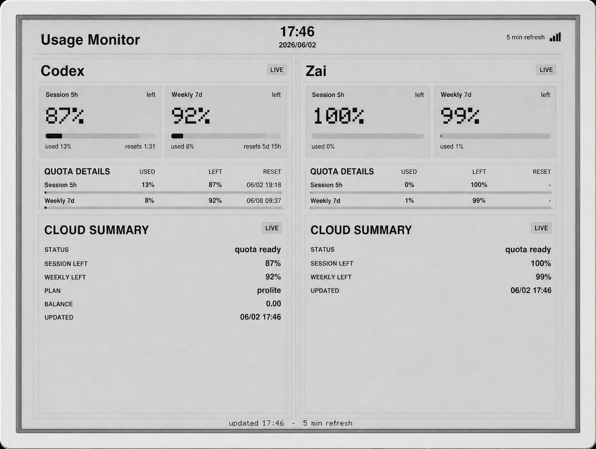
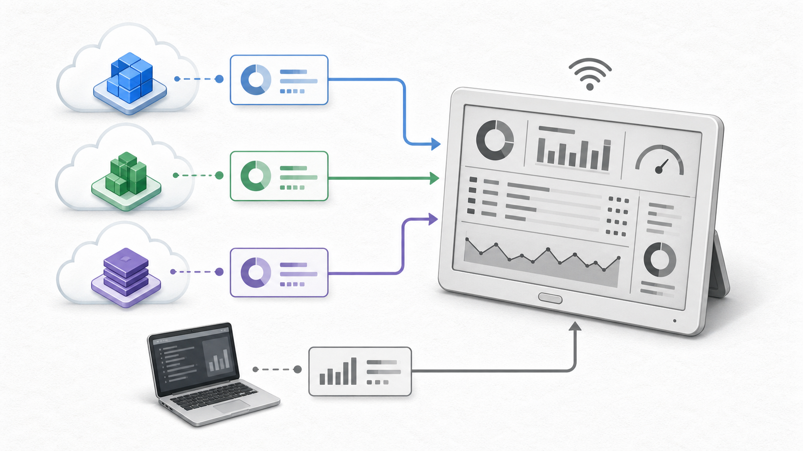
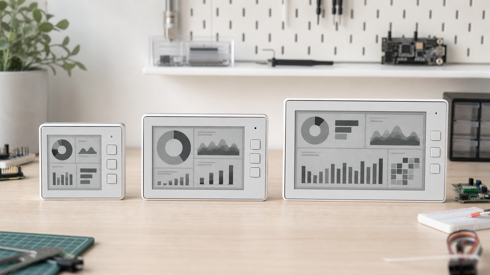
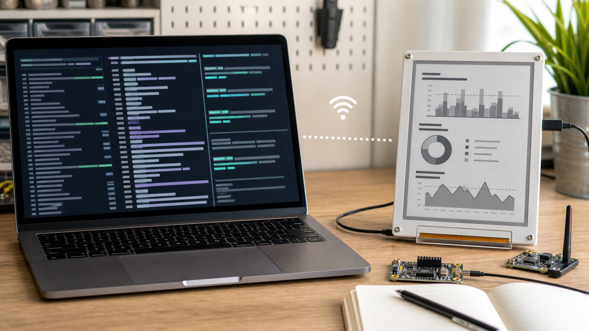
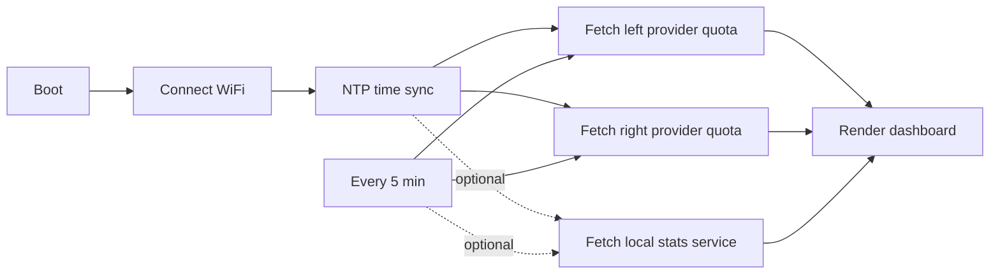

# UsageMonitor


> 一块放在桌面上的 AI 编程助手额度墨水屏，让你不用打开网页，也能一直看见还剩多少额度。

[English](README.md) · 简体中文


UsageMonitor 会把 Seeed reTerminal E 系列墨水屏变成一个小型额度仪表盘。它可以左右双栏显示两个 AI 编程工具的额度，自动刷新 OAuth token，请求失败时保留上一次成功数据，还能选择接入电脑端本地 CLI 日志统计。

> 顶部和部分说明图是 AI 生成的概念展示图，用来帮助理解项目卖点。功能展示部分使用真实设备照片。

## 为什么值得 Star

- **额度一直看得见**：把 5 小时窗口和 7 天窗口放到低功耗墨水屏上，不用反复打开网页查。
- **两个平台同屏对比**：左栏和右栏可以显示不同 provider，适合同时使用多个 AI 编程助手的人。
- **云端额度 + 本地统计**：默认显示云端额度；开启电脑端服务后，还能显示今日 token、会话数、最近活动和模型排行。
- **不是纸面 Demo**：项目包含 ESP32-S3 固件、HTTPS 请求、OAuth 刷新、NVS token 持久化和 native 单元测试。
- **适配 reTerminal E 系列**：已经准备好 E1001、E1002、E1003，以及 E1003 简体中文构建环境。
- **方便继续魔改**：各 provider 的逻辑拆在独立 client 里，后面要加新数据源时，不需要重写整套 UI。

一句话总结：这个项目适合想把 AI 工具用量“实体化”到桌面硬件上的人。

## 功能展示



这是 reTerminal E1003 上运行 Codex + Zai 双栏仪表盘的实拍效果图，已经做了透视校正和轻微清晰度增强。

| 功能 | 你会得到什么 |
| --- | --- |
| **5 小时窗口** | 大号剩余百分比、已用进度条、重置倒计时，是屏幕上最醒目的部分。 |
| **7 天窗口** | 辅助显示一周额度，方便你判断今天该不该继续高强度使用。 |
| **额度详情表** | 紧凑显示已用、剩余、重置时间，以及 provider 返回的真实补充字段。 |
| **平台补充信息** | 有余额、套餐、额外消费、模型额度等真实数据时，就显示出来。 |
| **失败兜底** | 请求失败时不会整屏空白，而是继续显示上次成功数据，并标记为陈旧。 |
| **中英文 UI** | 默认英文；E1003 有简体中文构建，会在编译时把中文字体内嵌进固件。 |

一句话总结：屏幕不是只显示一个数字，而是把“还能用多久、哪里快满了、数据新不新”一起摆出来。

## 连接哪些数据



固件可以直接通过 HTTPS 请求各 provider 的用量接口。可选的本地统计服务运行在你的电脑上，读取本地 CLI 日志，再通过一个统一 JSON 接口给墨水屏读取。

当前项目里的 provider 适配情况：

| Provider | 固件云端额度 | 可选本地统计 |
| --- | --- | --- |
| Claude | 支持 | 支持 |
| Codex | 支持 | 支持 |
| Copilot | 支持 | 支持 |
| MiniMax | 支持 | 支持 |
| Kimi | 支持 | 支持 |
| Zai / 智谱 | 支持 | 支持 |

本地统计服务不会编造数据。某个平台没有可读取的本地日志时，会返回 `available=false`，固件会自动退回云端额度布局。

一句话总结：能从云端拿的数据直接拿，只有本机日志里确实存在的数据才作为增强信息显示。

## 支持的硬件



| 设备 | 屏幕 | 布局 |
| --- | --- | --- |
| reTerminal E1001 | 4 级灰 | 精简双栏 |
| reTerminal E1002 | 6 色 | 精简双栏，支持颜色状态提示 |
| reTerminal E1003 | 16 级灰 | 完整双栏仪表盘 |
| reTerminal E1003 中文 | 16 级灰 | 完整仪表盘，使用内嵌中文字体渲染 |

一句话总结：小屏可以跑精简版，大屏可以跑完整仪表盘。

## 快速开始

### 1. 安装 PlatformIO

通过 VS Code 或命令行安装 [PlatformIO](https://platformio.org/)。

PlatformIO 可以理解成“嵌入式项目管家”：它负责下载依赖、编译固件、把固件烧录到设备里。

一句话总结：先装好能编译和烧录固件的工具。

### 2. 准备 token

先在电脑上用官方 CLI 登录，让凭证文件存在：

- Claude：`claude login` 会写入 `~/.claude/.credentials.json`
- Codex：`codex login` 会写入 `~/.codex/auth.json`

然后复制 secrets 模板并填写：

```sh
cp include/secrets.example.h src/secrets.h
```

辅助脚本可以从本地凭证文件里打印现成的 `#define` 行：

```sh
python3 scripts/provision.py
```

把脚本输出和你的 WiFi 信息粘贴进 `src/secrets.h`。这个文件已经被 git 忽略，真实 token 不会被提交进仓库。

> 设备本身不能打开浏览器完成 OAuth 登录。只要 refresh token 有效，它会自己刷新；如果 refresh token 失效，你需要在电脑上重新登录并重新烧录。

一句话总结：先让电脑拿到登录凭证，再把设备需要的安全信息写进本地 secrets 文件。

### 3. 编译与烧录

```sh
# reTerminal E1001 / E1002 / E1003, English
pio run -e reterminal_e1001 --target upload
pio run -e reterminal_e1002 --target upload
pio run -e reterminal_e1003 --target upload

# reTerminal E1003, Codex on the left and Zai/Zhipu on the right
pio run -e reterminal_e1003_codex_zai --target upload

# Same display pair, with optional computer-side local stats enabled
pio run -e reterminal_e1003_codex_zai_local --target upload

# reTerminal E1003, Simplified Chinese
pio run -e reterminal_e1003_zh --target upload
```

中文字体会在编译时内嵌进固件，所以只需要一次 `upload`。查看串口输出：

```sh
pio device monitor
```

一句话总结：选一个和你硬件、语言、provider 组合对应的环境，然后烧录。

## 可选：电脑端本地统计服务



在保存 CLI 日志的电脑上启动服务：

```sh
python3 local_stats_service/server.py --host 0.0.0.0 --port 8787
```

查看这台电脑的局域网 IP。macOS 使用 WiFi 时，优先试：

```sh
ipconfig getifaddr en0
```

如果没有输出，再试：

```sh
ipconfig getifaddr en1
```

这里要填 `192.168.x.x` 或 `10.x.x.x` 这种局域网地址。不要填 `127.0.0.1`，它的意思是“这台电脑自己”，墨水屏设备访问不到。

在 `src/secrets.h` 里设置 `UM_LOCAL_STATS_URL`：

```cpp
#define UM_LOCAL_STATS_URL "http://10.10.50.65:8787"
```

然后烧录带 `UM_ENABLE_LOCAL_STATS` 的环境：

```sh
pio run -e reterminal_e1003_codex_zai_local --target upload
```

默认会扫描 `~/.claude/projects`、`~/.codex` 等常见 CLI 目录。你也可以用环境变量覆盖某个平台的日志目录，例如 `UM_LOCAL_CLAUDE_LOG_DIR` 或 `UM_LOCAL_CODEX_LOG_DIR`。

一句话总结：电脑负责读本地日志，墨水屏通过局域网拿到统计结果。

## 工作原理



设备会持有 OAuth token，通过 HTTPS 调用各 provider 的用量接口。token 到期时，它会尝试自己刷新，并把轮换后的新 token 保存到 NVS。

OAuth token 可以理解成“临时通行证”：设备拿着它去访问用量接口；refresh token 则像“续签凭证”，用来换新的临时通行证。

NVS 可以理解成 ESP32 里的“小抽屉”：断电后也能保存少量配置和 token。

一句话总结：设备开机后连 WiFi、校准时间、拉取数据、画到屏幕上，然后定时重复。

| 模块 | 职责 |
| --- | --- |
| `src/main.cpp` | 程序入口和顶层配置 |
| `UsageApp.*` | 编排开机、WiFi、NTP、轮询和持久化 |
| `HttpClient.*` | HTTPS 传输、响应头和 Retry-After 处理 |
| `OAuthClient.*` | 带刷新重试的鉴权请求 |
| `TokenStore.*` | 轮换后 token 的 NVS 持久化 |
| `*UsageClient.*` | 各 provider 云端额度适配器 |
| `LocalStatsClient.*` | 可选电脑端本地统计客户端 |
| `UsageUI.*` | 墨水屏绘制 |
| `TextRenderer.*` | 英文字体和中文 OpenFontRender 路径 |
| `UiLang.h` | 固定 UI 文案和语言选择 |
| `QuotaMath.h` / `TimeFormat.h` / `IsoTime.h` / `HeaderField.h` / `UsageSnapshot.h` | 纯逻辑，native 测试覆盖 |
| `local_stats_service/` | 可选 Python 本地统计服务 |

一句话总结：代码按“联网拿数据、处理数据、画到屏幕”拆成了几个小模块。

## 开发

运行 native 单元测试：

```sh
pio test -e native
```

native 单元测试就是“不需要真实硬件也能跑的测试”。这里主要覆盖额度计算、倒计时格式化、UTC/ISO8601 时间解析、token 过期判断、header/body 字段选择等纯逻辑。

一句话总结：很多核心计算可以先在电脑上测，不一定每次都烧录到设备上。

## 安全说明

- 真实 WiFi 密码和 OAuth token 只放在 `src/secrets.h`。
- 本地统计服务用 `--host 0.0.0.0` 启动时会监听局域网，只建议在可信网络中使用。
- HTTPS 调用为了开发方便使用了 `setInsecure()` 简化证书处理。生产固件建议为 provider 域名固定 CA 证书。
- 这些用量接口不是官方公开 API，而是从 CLI 推导出来的，可能随 CLI 升级而变化。调用失败时，固件会降级显示上次成功快照。

一句话总结：不要提交密钥，本地服务只在可信网络里开，用量接口变化时要准备重新适配。
